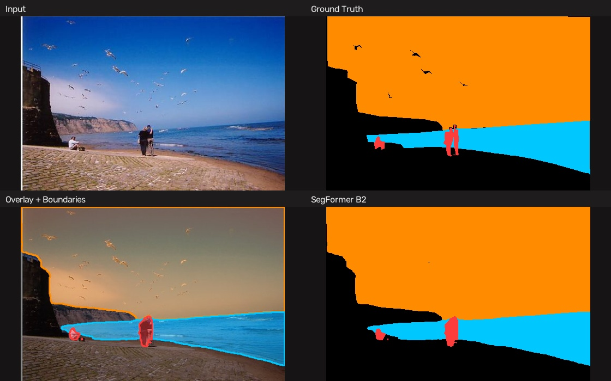
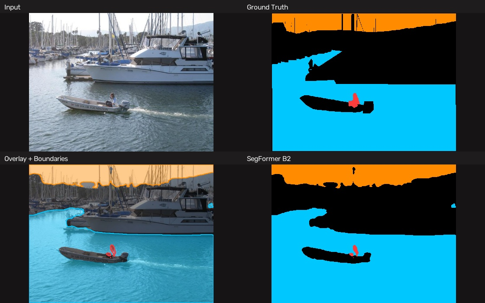
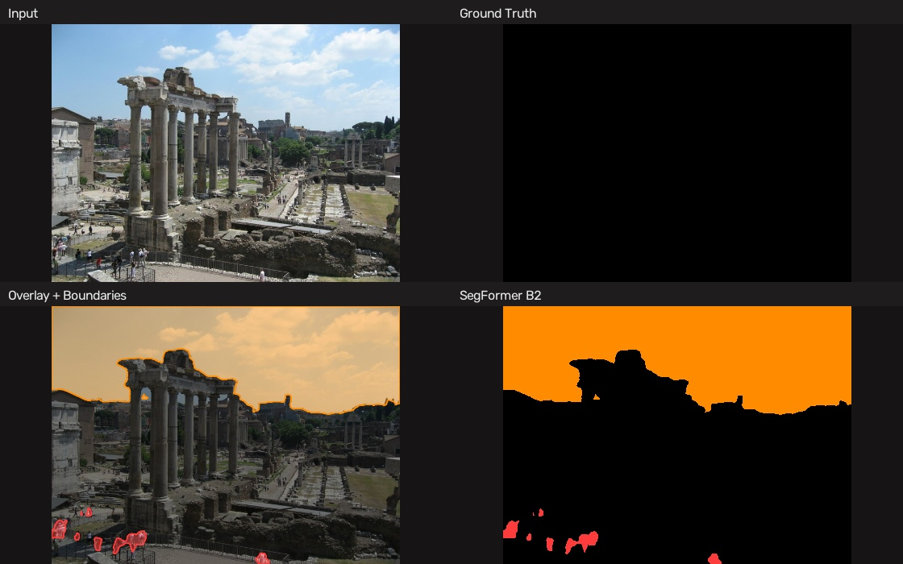
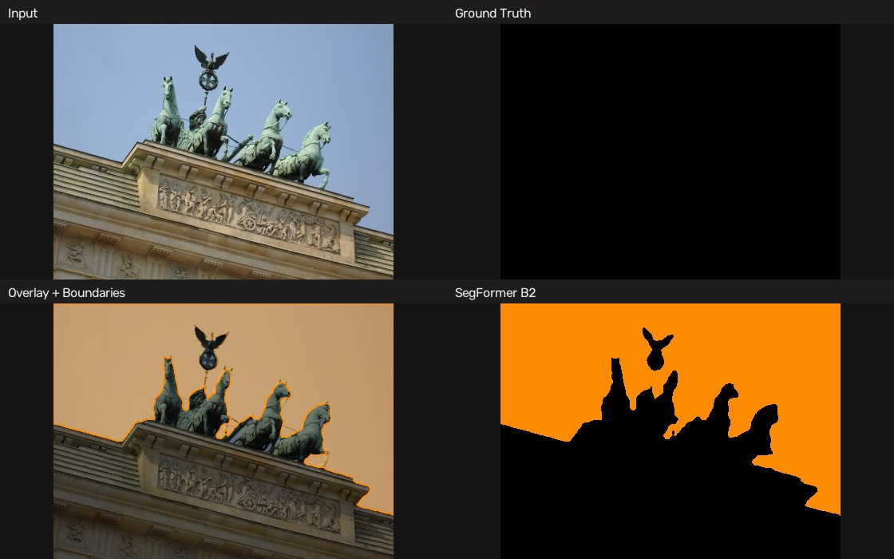

# 🌊 Sky-Water-Person Segmentation

**Auto-annotation → training → deployment.** A complete pipeline that generates segmentation masks with Grounding DINO + SAM, trains a lightweight model, and deploys via ONNX / CoreML. Built with `uv`, optimized for NVIDIA GPUs and Apple Silicon.

> **Goal:** Mask out sky, water, and person regions to eliminate interference in SfM and image matching pipelines.
>
> **Current model:** SegFormer MiT-B2 (24.7M params), fine-tuned on ADE20K sky/water/person subset.  
> **Author:** [Vincent Qin](https://github.com/Vincentqyw)

---

## Evaluation

SegFormer B2 (`best_model.pth`) on ADE20K validation set (1,111 images, 384×384 input):

| Class | IoU | Dice | Precision | Recall |
|-------|-----|------|-----------|--------|
| Background | 96.6% | 98.3% | 98.9% | 97.7% |
| **Sky** | **92.1%** | **95.9%** | 93.3% | 98.6% |
| **Water** | 79.6% | 88.6% | 90.1% | 87.3% |
| **Person** | 77.8% | 87.5% | 85.2% | 89.9% |
| **Mean (fg)** | **88.1%** | **93.7%** | — | — |
| **mIoU (all)** | **94.7%** | — | — | — |
| **Pixel Accuracy** | **97.3%** | — | — | — |

---

## Visualization

**SegFormer B2** (MiT-B2 encoder, 24.7M params). 2×2 layout: **Input | Ground Truth** (top), **Overlay + Boundaries | SegFormer B2** (bottom). Sky = orange, Water = cyan, Person = red.

### ADE20K Validation (with ground truth)

<table>
<tr>
<td></td>
<td></td>
</tr>
<tr>
<td></td>
<td></td>
</tr>
<tr>
<td></td>
<td></td>
</tr>
</table>

### Real-World Images (SkySeg test set, no GT)

<table>
<tr>
<td></td>
<td></td>
</tr>
<tr>
<td></td>
<td></td>
</tr>
<tr>
<td></td>
<td></td>
</tr>
</table>

Per-class contours drawn on the overlay (bottom-left) show segmentation boundaries. Original images in `assets/`, per-image outputs in `results/<name>/`.

---

## Quick Start

### Install

```bash
# Install uv (skip if already installed)
curl -LsSf https://astral.sh/uv/install.sh | sh

# Clone & install all dependencies
cd skywater
uv sync

# Verify
uv run python -c "import torch; print(f'CUDA: {torch.cuda.is_available()}, MPS: {torch.backends.mps.is_available()}')"
```

### Run the Full Pipeline

```bash
# Auto-detect hardware & use optimal settings
uv run python run_pipeline.py --image-dir data/images

# Individual phases
uv run python run_pipeline.py --image-dir data/images --annotate-only
uv run python run_pipeline.py --image-dir data/images --train-only
uv run python run_pipeline.py --export-only --checkpoint checkpoints/skywater-seg/best_model.pth
```

### Inference

```bash
# PyTorch
uv run python inference.py --checkpoint checkpoints/skywater-seg/best_model.pth -i test.jpg

# ONNX Runtime (no PyTorch needed)
uv run python inference.py --onnx checkpoints/skywater-seg/skywater_seg.onnx -i test.jpg
```

---

## Phase 1 — Auto-Annotation

Uses Grounding DINO to detect regions from text prompts, then SAM to produce pixel-perfect masks.

```bash
# MacBook / low-memory: tiny + vit_b (fast, ~3–5s per image)
uv run python scripts/auto_annotate.py -i data/images -o data/masks

# GPU / high-quality: base + vit_l (~8–12s per image)
uv run python scripts/auto_annotate.py -i data/images -o data/masks \
    --gdino-model base --sam-model vit_l

# Single image
uv run python scripts/auto_annotate.py -i test.jpg -o ./output
```

**Output:**
```
data/masks/
├── IMG_0001_mask.png          # 0=bg, 1=sky, 2=water, 3=person
├── IMG_0001_vis.jpg           # Visualization overlay
├── annotation_summary.json    # Per-image stats
└── ...
```

---

## Phase 2 — Training

### Datasets

The pipeline supports multiple dataset sources:

| Dataset | Format | Classes | Notes |
|---------|--------|---------|-------|
| Custom (flat dir) | `images/*.jpg` + `masks/*_mask.png` | Any | Default mode |
| ADE20K (ADEChallengeData2016) | `images/` + `annotations/` with class remapping | sky, water, person | 150→4 class mapping |
| Cityscapes | `leftImg8bit/` + `gtFine/` subdirectories | sky, water, person | Auto city-split detection |
| Multi-dataset | Mix any of the above with sampling weights | 4 | Combined `MultiDataset` |

### Config Presets

| Config | Dataset | Model | Classes | Use Case |
|--------|---------|-------|---------|----------|
| `default.yaml` | Custom flat dir | MobileNetV3-Large (~5M) | 3 | Quick start, custom data |
| `ade_challenge.yaml` | ADE20K full | MobileNetV3-Large (~5M) | 4 | Cost-effective ADE20K |
| `ade20k_person.yaml` | ADE20K filtered | MobileNetV3-Large (~5M) | 4 | Pre-filtered sky/water/person |
| `convnext_dinov3.yaml` | ADE20K filtered | ConvNeXt-Tiny + DINOv3 (~29M) | 4 | High quality, distilled weights |
| `multi_dataset.yaml` | ADE20K + Cityscapes | ConvNeXt-Tiny + DINOv3 (~29M) | 4 | Best generalization |

### Running Training

```bash
# Basic training on custom data
uv run python train.py --config configs/default.yaml \
    --data.image_dir data/images \
    --data.mask_dir data/masks

# ADE20K with filtered split (sky/water/person present)
uv run python scripts/prepare_ade20k_person.py   # one-time: generate split files
uv run python train.py --config configs/ade20k_person.yaml

# High-quality model with ConvNeXt + DINOv3
uv run python train.py --config configs/convnext_dinov3.yaml

# Multi-dataset (ADE20K + Cityscapes)
uv run python train.py --config configs/multi_dataset.yaml

# CLI overrides (dot notation, auto-typed)
uv run python train.py --config configs/default.yaml \
    --train.epochs 100 --train.batch_size 8 --train.learning_rate 0.0001

# Resume from checkpoint
uv run python train.py --config configs/default.yaml \
    --train.resume_from checkpoints/skywater-seg/best_model.pth

# Monitor
uv run tensorboard --logdir checkpoints/skywater-seg/logs
```

### Model Architecture Options

| Encoder | Params | Weights | Preset |
|---------|--------|---------|--------|
| `timm-mobilenetv3_large_100` | ~5M | ImageNet | `lightweight` |
| `timm-mobilenetv3_small_050` | ~2M | ImageNet | `ultra-lightweight` |
| `timm-efficientnet-b0` | ~5M | ImageNet | `balanced` |
| `timm-efficientnet-b3` | ~12M | ImageNet | `accurate` |
| `convnext-tiny` | ~29M | DINOv3 / ImageNet-22K | `convnext_dinov3` |
| `convnext-small` | ~50M | DINOv3 / ImageNet-22K | — |
| `convnext-base` | ~89M | DINOv3 / ImageNet-22K | — |

All SMP-native encoders (ResNet, EfficientNet, MiT, etc.) are also supported.

### Loss Functions

| Loss | Config Key | Description |
|------|-----------|-------------|
| CrossEntropy + Dice | `dice_ce` | **Default.** Balanced per-pixel + region overlap |
| CrossEntropy | `ce` | Per-pixel only |
| Dice | `dice` | Region overlap only |
| Focal | `focal` | Focuses on hard examples, handles class imbalance |
| Jaccard (IoU) | `jaccard` | Direct IoU optimization |

---

## Phase 3 — Export & Deployment

```bash
# PyTorch → ONNX (cross-platform)
uv run python inference.py --checkpoint checkpoints/skywater-seg/best_model.pth \
    --export-onnx skywater_seg.onnx

# ONNX → CoreML (macOS only, Apple Neural Engine)
uv run python inference.py --checkpoint checkpoints/skywater-seg/best_model.pth \
    --export-coreml skywater_seg.mlpackage

# PyTorch → TorchScript
uv run python inference.py --checkpoint checkpoints/skywater-seg/best_model.pth \
    --export-torchscript skywater_seg.pt
```

### Export Chain

```
PyTorch (.pth)  →  ONNX (.onnx)  →  CoreML (.mlpackage)  →  Apple Neural Engine
                →  TorchScript (.pt)
                →  TensorRT (.trt) via trtexec CLI
```

---

## Performance

### Inference Speed

| Method | Device | Speed | Model Size |
|--------|--------|-------|------------|
| **CoreML (ANE)** | Apple Neural Engine | ~3 ms | ~10 MB |
| ONNX Runtime (CUDA) | NVIDIA GPU | ~5 ms | ~15 MB |
| PyTorch (CUDA FP16) | NVIDIA GPU | ~8 ms | ~20 MB |
| PyTorch (MPS) | Apple Silicon GPU | ~12 ms | ~20 MB |
| ONNX Runtime (CPU) | CPU | ~15 ms | ~15 MB |

### Annotation Speed (per image)

| Models | Hardware | Time |
|--------|----------|------|
| GDINO-tiny + SAM vit_b | MPS / 6 GB GPU | ~3–5 s |
| GDINO-base + SAM vit_l | 16 GB+ GPU | ~8–12 s |
| GDINO-base + SAM vit_h | 32 GB+ GPU | ~15–20 s |

---

## Project Structure

```
skywater/
├── scripts/
│   ├── auto_annotate.py              # Grounding DINO + SAM pipeline
│   ├── extract_ade20k.py             # ADE20K → sky/water masks
│   └── prepare_ade20k_person.py      # Filter ADE20K for sky/water/person splits
├── skywater_seg/
│   ├── config.py                     # Typed config (dataclass + YAML)
│   ├── dataset.py                    # Dataset + MultiDataset + dataloader factory
│   ├── model.py                      # Model factory (SMP + ConvNeXt custom)
│   ├── losses.py                     # Dice, Focal, Jaccard, Combined losses
│   ├── trainer.py                    # Training loop (AMP, loguru, TensorBoard)
│   ├── inference.py                  # PyTorch + ONNX Runtime inference & export
│   ├── coreml_export.py              # CoreML conversion & ANE inference (macOS)
│   ├── utils.py                      # Metrics, visualization, checkpoint, schedulers
│   └── cli.py                        # Package console_scripts entry points
├── assets/                            # Test images (ADE20K + real-world)
├── results/                           # Per-image outputs (mask, overlay, figure)
├── configs/
│   ├── default.yaml                  # Custom flat-dir dataset, 3-class
│   ├── ade_challenge.yaml            # ADE20K full, 4-class, 256px
│   ├── ade20k_person.yaml            # ADE20K filtered split, 4-class
│   ├── convnext_dinov3.yaml          # ConvNeXt-Tiny + DINOv3, 4-class
│   ├── multi_dataset.yaml            # ADE20K + Cityscapes mixed training
│   └── custom_classes_example.json   # Custom class definitions for annotation
├── train.py                          # Training entry point
├── inference.py                      # Inference / export entry point
├── run_pipeline.py                   # End-to-end pipeline orchestrator
└── pyproject.toml                    # uv project config + dependencies
```

---

## Environment Management

```bash
uv sync                          # All dependencies
uv sync --group annotate         # Annotation only (GDINO + SAM)
uv sync --group train            # Training only (SMP, albumentations, timm)
uv sync --group deploy           # Export only (ONNX, CoreML)
uv sync --no-dev                 # Production (no dev deps)

uv add <package>                 # Add dependency
uv remove <package>              # Remove dependency
uv tree                          # View dependency tree
```

### Package CLI Entry Points

```bash
skywater-annotate -i data/images -o data/masks
skywater-train --config configs/default.yaml
skywater-infer --checkpoint model.pth --input test.jpg
```

---

## Key Technical Details

- **Normalization:** ImageNet stats (`mean=[0.485, 0.456, 0.406]`, `std=[0.229, 0.224, 0.225]`)
- **Input size:** Configurable (default 512×512)
- **Mask format:** Single-channel PNG, values 0–3, naming: `{stem}_mask.png`
- **Class remapping:** `class_mapping` dict in config for arbitrary source→target mappings
- **Multi-dataset:** `MultiDataset` wrapper with weighted random sampling via `mix_weights`
- **AMP:** Mixed-precision training via `torch.amp` (CUDA only; skipped on MPS/CPU)
- **Checkpoints:** Full state dicts (model + optimizer + scheduler + epoch + metrics + timestamp)
- **Logging:** loguru (console + rotating file) + TensorBoard (metrics, IoU, gradients, weights, prediction overlays)
- **Device:** Auto-fallback cuda → mps → cpu; `pin_memory` disabled on MPS/Windows

---

## References

- [Grounding DINO](https://github.com/IDEA-Research/GroundingDINO) — Open-set object detection
- [SAM](https://github.com/facebookresearch/segment-anything) — Segment Anything Model
- [segmentation-models-pytorch](https://github.com/qubvel/segmentation_models.pytorch) — SMP library
- [DINOv3](https://github.com/facebookresearch/dinov3) — Meta's distilled ConvNeXt weights
- [coremltools](https://github.com/apple/coremltools) — Apple CoreML conversion
- [uv](https://github.com/astral-sh/uv) — Python package manager

---

## License

MIT

---

## Citation

If you use this project in your research, please cite:

```bibtex
@misc{qin2026skywater,
  author       = {Vincent Qin},
  title        = {Sky-Water-Person Segmentation: Auto-Annotation, Training, and Deployment Pipeline},
  year         = {2026},
  howpublished = {\url{https://github.com/Vincentqyw/skywater}},
  note         = {Version 0.3.0. SegFormer MiT-B2 fine-tuned on ADE20K.}
}
```

Or in plain text:

> Qin, V. (2026). *Sky-Water-Person Segmentation: Auto-Annotation, Training, and Deployment Pipeline* (v0.3.0). GitHub. https://github.com/Vincentqyw/skywater
