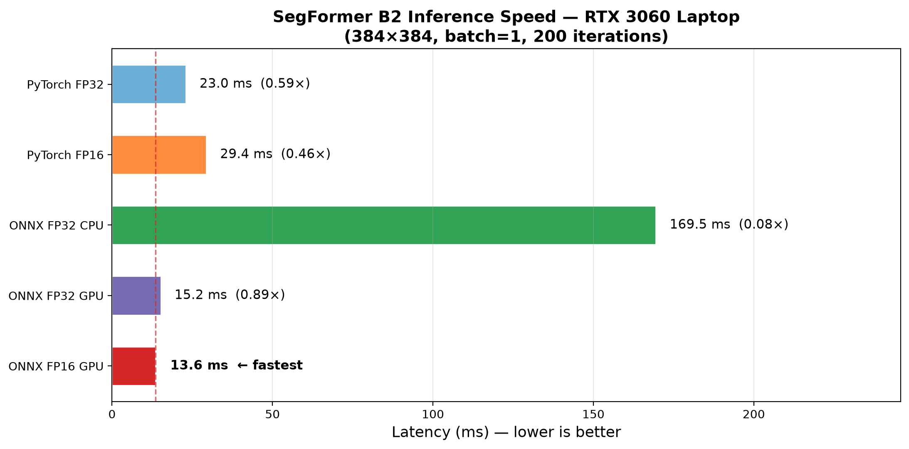
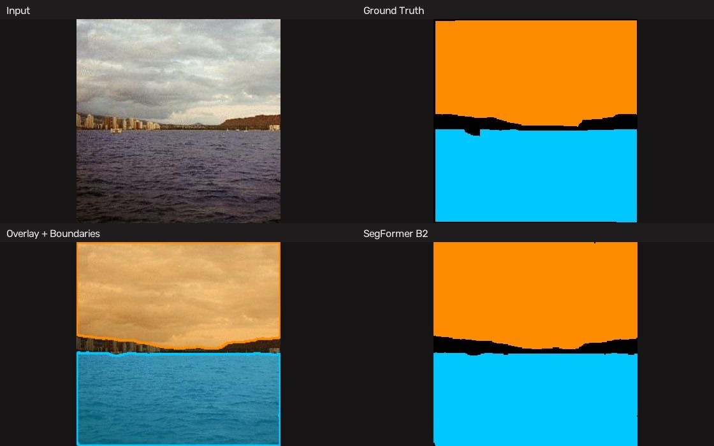
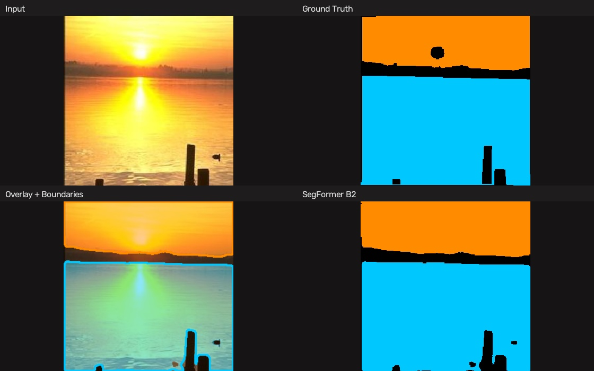
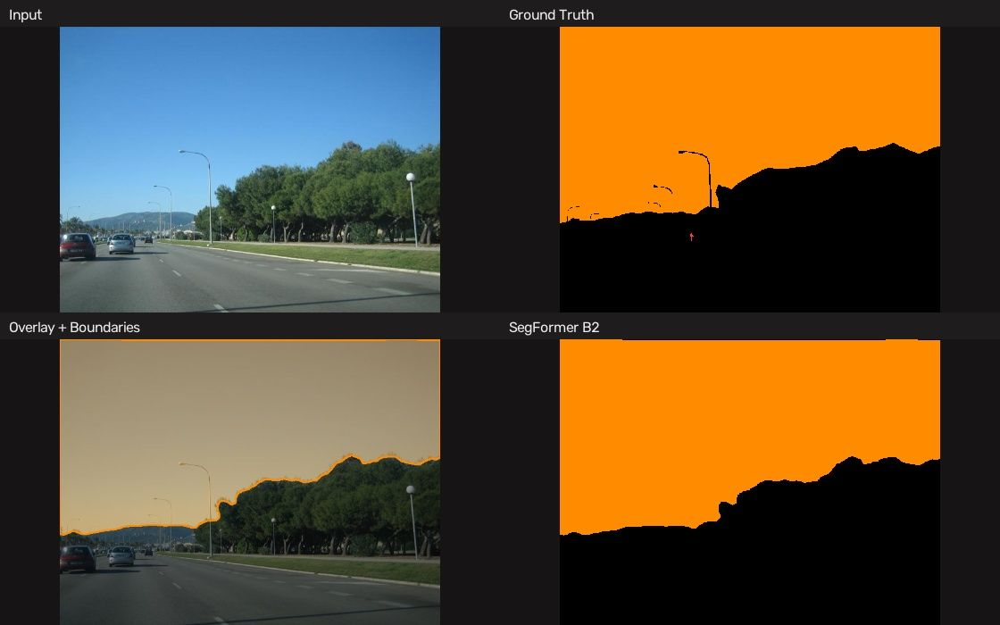
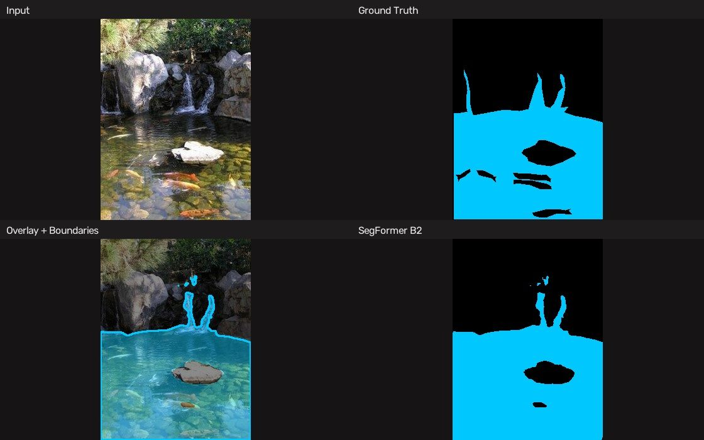
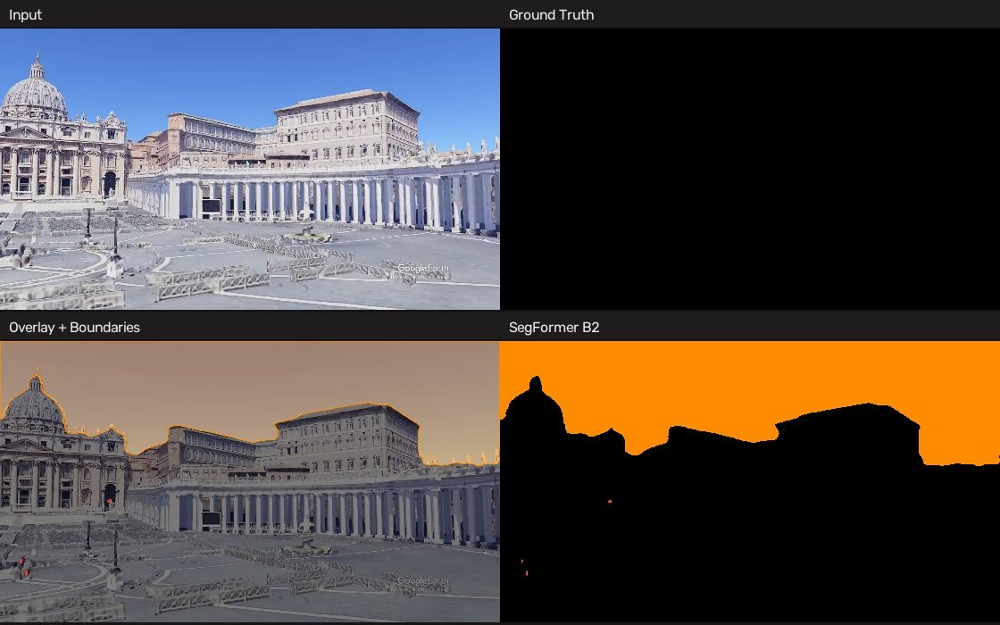
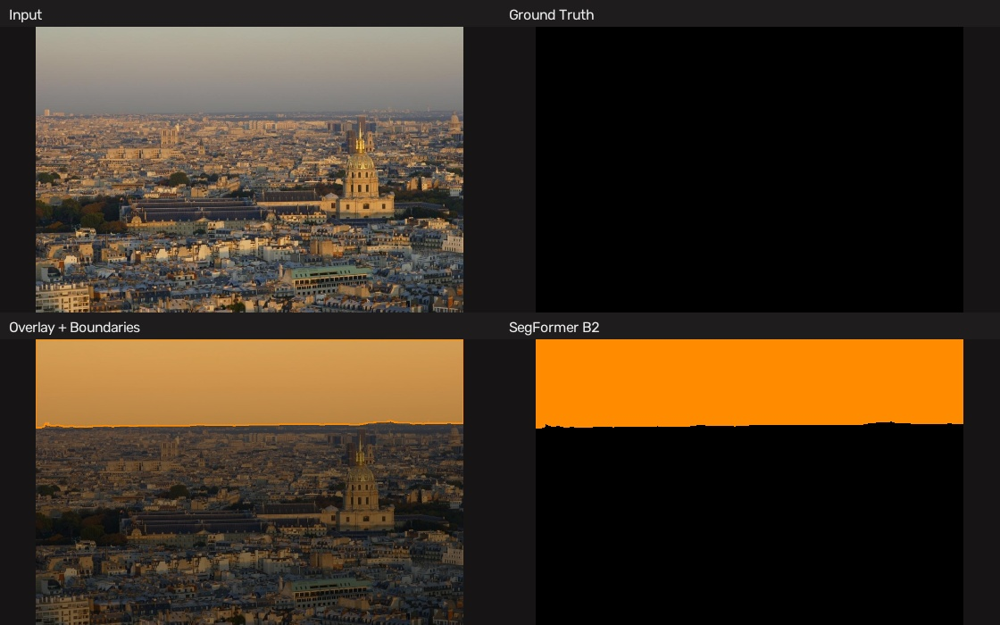
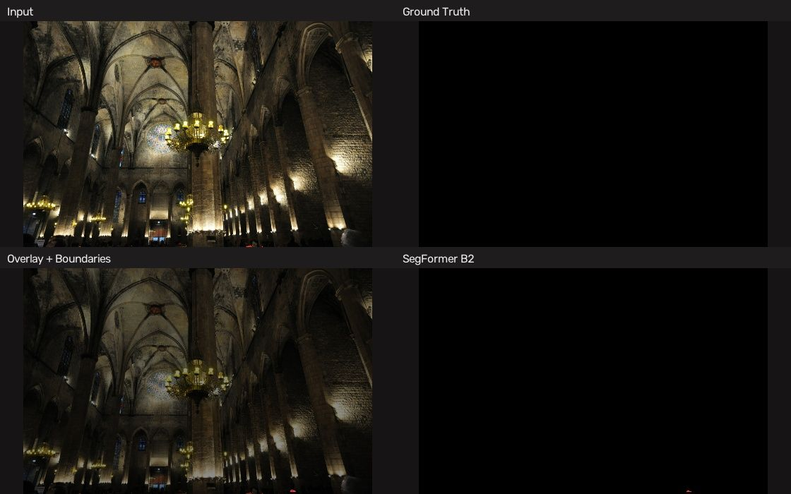
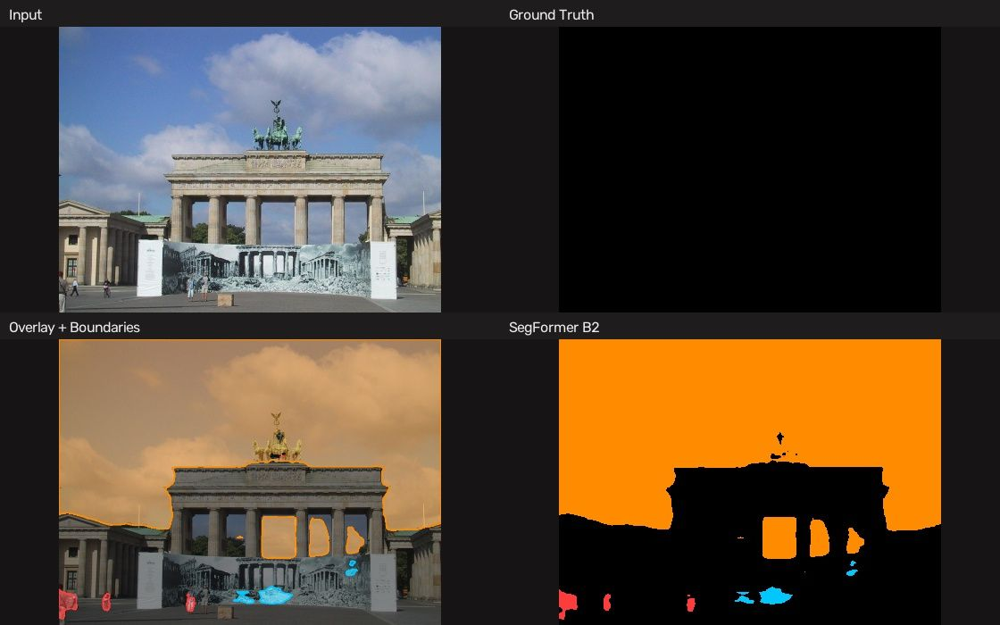

# 🌊 Sky-Water-Person Segmentation

[](LICENSE)
[](https://www.python.org/)
[](https://huggingface.co/Realcat/skywater_seg)

**Auto-annotation → training → deployment.** Mask out sky, water, and person
regions to eliminate interference in SfM and image matching pipelines.

<p align="center">
  
</p>


---

## 📊 Performance

**SegFormer MiT-B2** (24.7M params) · 384×384 · ADE20K filtered val (1,111 images)

### Accuracy

| Class | IoU | Dice |
|-------|-----|------|
| Background | 96.6% | 98.3% |
| Sky | **92.1%** | 95.9% |
| Water | 79.4% | 88.5% |
| Person | 77.8% | 87.5% |
| **Foreground mIoU** | **88.1%** | — |
| **Overall mIoU / PA** | **94.6%** / **97.2%** | — |

### Speed (RTX 3060 Laptop)

| Backend | Latency | vs PyTorch |
|---------|---------|------------|
| ONNX FP16 GPU | **13.6 ms** | **1.7× faster** |
| ONNX FP32 GPU | 15.2 ms | 1.5× faster |
| PyTorch FP32 | 23.0 ms | baseline |

<p align="center">
  
</p>

---

## 🚀 Quick Start

```bash
curl -LsSf https://astral.sh/uv/install.sh | sh
git clone https://github.com/Vincentqyw/skywater.git && cd skywater
uv sync
```

```python
from skywater_seg import load_model, segment, overlay_mask

model = load_model()                         # from HuggingFace, auto-download
mask  = segment("photo.jpg", model)          # 0=bg, 1=sky, 2=water, 3=person
overlay_mask("photo.jpg", mask)            # visualize
```

```bash
# Or CLI — from HuggingFace
uv run python inference.py --hf -i photo.jpg

# Or CLI — ONNX GPU (faster, no PyTorch needed)
uv run python inference.py --onnx skywater_segformer_b2_fp16.onnx -i photo.jpg
```

### Pre-trained Models

| Model | Format | Size | Link |
|-------|--------|------|------|
| SegFormer B2 | PyTorch (safetensors) | ~95 MB | [HF Hub](https://huggingface.co/Realcat/skywater_seg) |
| SegFormer B2 | PyTorch (full ckpt) | 284 MB | [.pth](https://huggingface.co/Realcat/skywater_seg/resolve/main/skywater_segformer_b2.pth) |
| SegFormer B2 | ONNX FP32 | 95 MB | [.onnx](https://huggingface.co/Realcat/skywater_seg/resolve/main/skywater_segformer_b2_fp32.onnx) |
| SegFormer B2 | ONNX FP16 | 48 MB | [.onnx](https://huggingface.co/Realcat/skywater_seg/resolve/main/skywater_segformer_b2_fp16.onnx) |

---

## 📸 Sample Results

### ADE20K Validation

<table>
<tr>
<td></td>
<td></td>
</tr>
<tr>
<td></td>
<td></td>
</tr>
</table>

### Real-World (SkySeg test set)

<table>
<tr>
<td></td>
<td></td>
</tr>
<tr>
<td></td>
<td></td>
</tr>
</table>

---

## 📖 Documentation

| Guide | Description |
|-------|-------------|
| [Auto-Annotation](docs/auto_annotation.md) | Grounding DINO + SAM pipeline — generate masks from text prompts |
| [Datasets](docs/datasets.md) | ADE20K setup, custom data format, multi-dataset training |
| [Training](docs/training.md) | Model configs, presets, loss functions, architecture options |
| [Evaluation & Benchmark](docs/evaluation.md) | Metrics, ONNX speed comparison, pixel identity validation |
| [Deployment](docs/deployment.md) | ONNX export, CoreML, TorchScript, Python API |

---

## 🏗️ Project Structure

```
skywater/
├── skywater_seg/          # Python package
│   ├── inference.py       # PyTorch + ONNX inference, export helpers
│   ├── model.py           # Model factory (SMP + ConvNeXt + SegFormer)
│   ├── config.py          # Typed config (dataclass + YAML)
│   ├── dataset.py         # Dataset + MultiDataset + dataloaders
│   ├── trainer.py         # Training loop (AMP, loguru, TensorBoard)
│   ├── losses.py          # Dice, Focal, Jaccard, Combined losses
│   ├── visualization.py   # Colorize, overlay, plots, comparison grids
│   └── utils.py           # Metrics, device, checkpoint, schedulers
├── scripts/
│   ├── auto_annotate.py   # Grounding DINO + SAM annotation pipeline
│   ├── prepare_ade20k_person.py  # ADE20K → sky/water/person splits
│   ├── eval_segformer_b2.py      # PyTorch metric evaluation
│   ├── benchmark_full.py         # ONNX export + speed/accuracy benchmark
│   └── gen_readme_figures.py     # Paper-style 2×2 comparison figures
├── configs/               # Training configs (YAML)
├── docs/                  # Documentation
├── tests/                 # Pytest suite
├── assets/                # Test images
├── results/               # Output: masks, figures, benchmarks
├── train.py               # Training entry point
├── inference.py           # Inference entry point
└── pyproject.toml
```

---

## 🔧 Development

```bash
uv sync                          # Full env
uv sync --group train            # Training only
uv sync --group dev              # Dev tools (pytest, matplotlib)

# Run tests
uv run pytest tests/ -v

# Export model for HF
uv run python scripts/benchmark_full.py
```

---

## 📝 Citation

```bibtex
@misc{qin2026skywater,
  author       = {Vincent Qin},
  title        = {{SkyWater-Seg}: Segmenting Sky, Water, and Person Regions
                  for Robust Structure-from-Motion Pre-processing},
  year         = {2026},
  howpublished = {\url{https://github.com/Vincentqyw/skywater}},
}
```

## 📄 License

MIT — [Vincent Qin](https://github.com/Vincentqyw)
